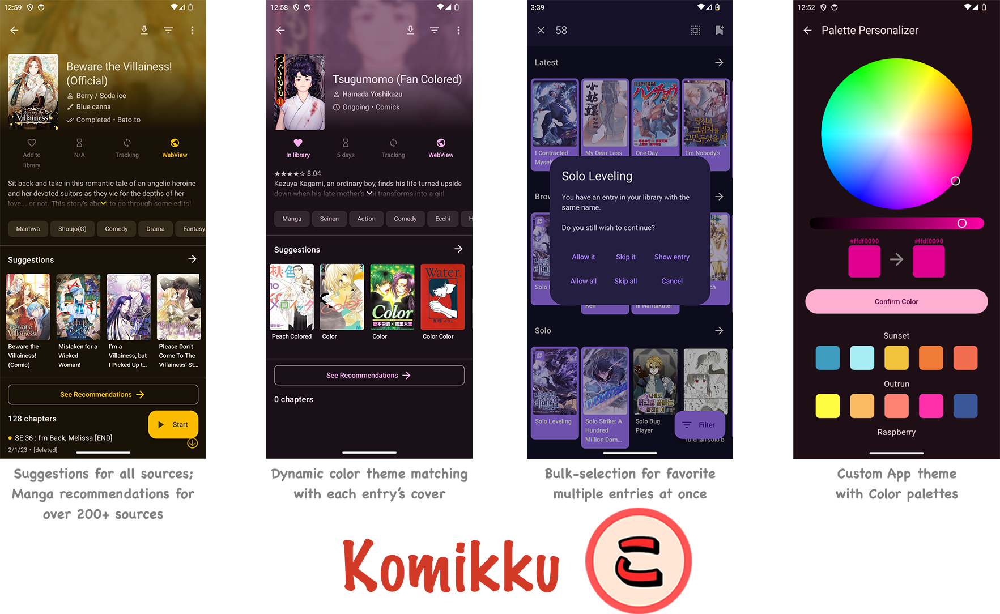

 
 <h1 align="center"> Komikku-Modify </h1>

| Releases |
|----------|
| 
   |

*Requires Android 8.0 or higher.*

## Download

*Requires Android 8.0 or higher.*

A modified fork of Komikku (based on TachiyomiSY & Mihon/Tachiyomi) with additional bug fixes, performance improvements, and UI enhancements.

## Features

### Modifications in this fork

- **Continuous auto-scroll**:
  - Pager mode: continuous auto page-turn with configurable interval (1–30 seconds).
  - Webtoon mode: continuous auto-scroll with configurable speed (px/s).
  - Independent preferences per mode (`continuousAutoScrollPager` / `continuousAutoScrollWebtoon`).
  - ▶️ button in reader bottom bar to toggle on/off.
  - Speed/interval adjustable via slider in Reading Mode settings.
  - `enableExhAutoScroll()` monitors preference changes and stops when disabled.

  
Komikku Features

- `Suggestions` automatically showing source-website's recommendations / related entries for all sources.
- `Hidden categories` to hide your things from *nosy* people.
- `Auto theme color` based on each entry's cover for entry View & Reader.
- `App custom theme` with `Color palettes` for endless color lover.
- `Bulk-favorite` multiple entries all at once.
- Source & Language icon on Library & various places.
- `Feed` now supports **all** sources, with more items (20 for now).
- Fast browsing for large libraries.
- Grouped entries in Update tab (inspired by J2K).
- Update notification with manga cover.
- Auto `2-way sync` progress with trackers.
- Chips for `Saved search` in source browse.
- `Panorama cover` showing wide cover in full.
- `Merge multiple` library entries together at same time.
- `Range-selection` for Migration.
- Ability to `enable/disable repo`, with icon.
- `Update Error` screen & migrating them away.
- `to-be-updated` screen: which entries are going to be checked with smart-update?
- `Search for sources` & Quick NSFW sources filter in Extensions, Browse & Migration screen.
- `Feed` backup/restore/sync/re-order.
- Long-click to add/remove single entry to/from library, everywhere.
- Docking Read/Resume button to left/right.
- In-app progress banner shows Library syncing / Backup restoring / Library updating progress.
- Auto-install app update.
- Configurable interval to refresh entries from downloaded storage.
- More app themes & better UI, improvements...

  
Mihon / Tachiyomi Features

* Online reading from a variety of sources
* Local reading of downloaded content
* A configurable reader with multiple viewers, reading directions and other settings.
* Tracker support: [MyAnimeList](https://myanimelist.net/), [AniList](https://anilist.co/), [Kitsu](https://kitsu.app/), [MangaUpdates](https://mangaupdates.com), [Shikimori](https://shikimori.one), [Bangumi](https://bgm.tv/)
* Categories to organize your library
* Light and dark themes
* Schedule updating your library for new chapters
* Create backups locally to read offline or to your desired cloud service
* Continue reading button in library

  
TachiyomiSY Features

* Feed tab, where you can easily view the latest entries or saved search from multiple sources at same time.
* Automatic webtoon detection, allowing the reader to switch to webtoon mode automatically when viewing one
* Manga recommendations, uses MAL and Anilist, as well as Neko Similar Manga for Mangadex manga
* Lewd filter, hide the lewd manga in your library when you want to
* Tracking filter, filter your tracked manga so you can see them or see non-tracked manga
* Search tracking status in library
* Custom categories for sources
* Manga info edit
* Manga Cover view + share and save
* Dynamic Categories, view the library in multiple ways
* Smart background for reading modes like LTR or Vertical
* Force disable webtoon zoom
* Hentai features enable/disable, in advanced settings
* Quick clean titles
* Source migration, migrate all your manga from one source to another
* Saving searches
* Autoscroll
* Page preload customization
* Customize image cache size
* Batch import of custom sources and featured extensions
* Advanced source settings page, searching, enable/disable all
* Click tag for local search, long click tag for global search
* Merge multiple of the same manga from different sources
* Drag and drop library sorting
* Library search engine
* New E-Hentai/ExHentai features
* Enhanced views for internal and integrated sources
* Enhanced usability for internal and delegated sources

Custom sources:
* E-Hentai/ExHentai

Additional features for some extensions:
* 8Muses (EroMuse)
* Mangadex
* NHentai
* Puruin
* LANraragi

### Disclaimer

The developer(s) of this application does not have any affiliation with the content providers available, and this application hosts zero content.

## License

    Copyright 2015 Javier Tomás

    Licensed under the Apache License, Version 2.0 (the "License");
    you may not use this file except in compliance with the License.
    You may obtain a copy of the License at

    http://www.apache.org/licenses/LICENSE-2.0

    Unless required by applicable law or agreed to in writing, software
    distributed under the License is distributed on an "AS IS" BASIS,
    WITHOUT WARRANTIES OR CONDITIONS OF ANY KIND, either express or implied.
    See the License for the specific language governing permissions and
    limitations under the License.
